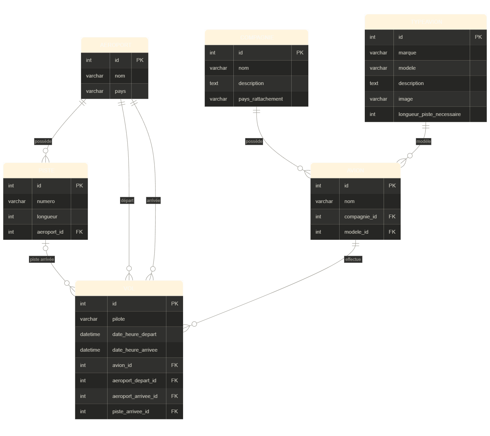

# SAE 2.03 — Gestion du Trafic Aérien

Application web Django pour gérer le trafic aérien : aéroports, pistes, compagnies, avions et vols.

## Prérequis

- Python 3.x
- Accès à un serveur MySQL (par défaut : `192.168.1.80:3306`)

## Installation

**1. Cloner le repo**
```bash
git clone <url_du_repo>
cd <nom_du_dossier>
```

**2. Créer l'environnement virtuel**
```bash
python -m venv venv
```
```bash
# Windows
./venv/Scripts/activate

# Linux / Mac
source venv/bin/activate
```

**3. Installer les dépendances**
```bash
pip install -r requirements.txt
```

**4. Créer la base de données**

Sur le serveur MySQL :
```sql
CREATE DATABASE trafic_aerien CHARACTER SET utf8mb4;
CREATE USER 'django_user'@'%' IDENTIFIED BY 'toto';
GRANT ALL PRIVILEGES ON trafic_aerien.* TO 'django_user'@'%';
FLUSH PRIVILEGES;
```

Puis exécuter les scripts SQL :
```bash
mysql -u django_user -p trafic_aerien < schema.sql
mysql -u django_user -p trafic_aerien < donnees.sql
```

**5. Configurer la connexion**

Dans `SAE203/settings.py`, modifier si besoin :
```python
DATABASES = {
    'default': {
        'ENGINE': 'django.db.backends.mysql',
        'NAME': 'trafic_aerien',
        'USER': 'django_user',
        'PASSWORD': 'toto',
        'HOST': '192.168.1.80',
        'PORT': '3306',
    }
}
```

**6. Lancer le serveur**
```bash
python manage.py runserver
```

L'application est accessible sur : http://127.0.0.1:8000/

## Fonctionnalités

- Gestion des aéroports, pistes, compagnies, types d'avions et avions (ajout, modification, suppression)
- Création de vols avec attribution automatique de piste selon la longueur disponible et les créneaux horaires
- Suggestion d'un créneau alternatif si toutes les pistes sont occupées
- Import de vols en masse via fichier CSV
- Fiches de vols filtrables par aéroport, date et sens (départs / arrivées), imprimables

## Format CSV pour l'import de vols

```
avion,pilote,aeroport_depart,date_heure_depart,aeroport_arrivee,date_heure_arrivee
F-GKXA,Jean Dupont,Charles de Gaulle,2026-06-01 08:00,Lyon Saint-Exupery,2026-06-01 09:15
```

## Structure du projet

```
SAE203/          → configuration Django (settings, urls)
TraficAerien/    → application principale
  models.py      → modèles (6 tables)
  views.py       → vues et logique métier
  forms.py       → formulaires
  urls.py        → routes
  templates/     → pages HTML
schema.sql       → création des tables
donnees.sql      → données de test
requirements.txt → dépendances Python
```

## Schéma Relationnel

